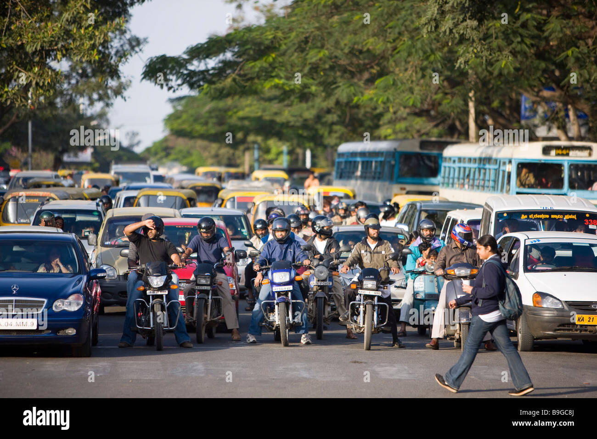

# Traffic Flow Prediction Project

## Project Description
This project predicts traffic density (High, Moderate, Low) based on input parameters like vehicle count, weather, time of day, and day of the week using Machine Learning models (Random Forest, Decision Tree, Linear Regression).

## Features
- Web-based interface using HTML, CSS, and Flask
- Real-time traffic prediction
- Data visualization using Matplotlib

## Technologies Used
- Python 3.11
- Flask
- Pandas, NumPy, Scikit-learn
- Matplotlib
- HTML, CSS, JavaScript

## How to Run
1. Clone this repository
2. Create virtual environment:
   ```bash
   python -m venv venv

###Activate virtual environment:

# Windows
venv\Scripts\activate

###Install dependencies:

pip install -r requirements.txt


###Run the project:

python trafficflow.py


###Notes

Large dataset files are not included due to GitHub size limits.

Screenshots and results can be seen in the static/ and templates/ folders.


---

### 🔹 **Tips:**
1. **Steps numbered clearly** — easy to follow  
2. **Commands in triple backticks ```bash```** — neat display  
3. **Large files / dataset note** — explain to anyone who downloads repo  
4. **Screenshots** — optional, add like this:

```markdown



## Dataset
Large dataset files are not included in this repository due to GitHub size limits.
Download the dataset here: [Google Drive link](https://drive.google.com/drive/folders/1JRpyHk8SE1b0KobNoE4xHJGsyk5JERmb?usp=drive_link)
